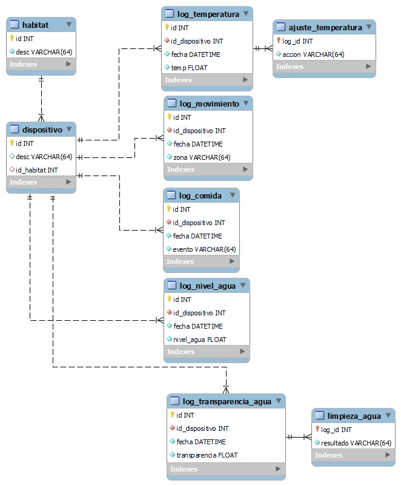

- Actualmente aprendo sobre **C++, SQL, Robótica, Desarrollo Web**

- Currículo en línea: [https://jrogelioruiz.github.io/RogelioRuiz/](https://jrogelioruiz.github.io/RogelioRuiz/)

- Portafolio: [https://github.com/JRogelioRuiz/RogelioRuiz](https://github.com/JRogelioRuiz/RogelioRuiz)

- Contacto: **A00835536@tec.mx**   

- Promedio Acumulado 3er Semestre: **99**

## Languages and Tools:

  
  
  
  
  

## Descripción de Evidencias

### IoT:

El propósito del proyecto era facilitar el cuidado de mascotas pequeñas utilizando sensores que permitieran recolectar información sobre el estatus del hábitat y los animales y utilizando actuadores para realizar tareas simples como rellenar la comida y el agua.

#### Hábitat de Hamster

**LINK:** [https://www.youtube.com/watch?v=UayfB8sX1us&t=1s](https://www.youtube.com/watch?v=UayfB8sX1us&t=1s)

<video width="320" height="240" controls>
  <source src="Assets/Jaula_Hamster.mp4" type="video/mp4">
</video>

Software Utilizados:

- ArduinoIDE
- Node.js
- Base de datos en SQL

<!--  -->

### C++:

Conocimientos adquiridos: 
- Algoritmos de ordenamiento
- Algoritmos de búsqueda
- Estructuras de datos: linked lists, heaps, trees, graph traversal.  

#### Evidencia 1
  Lectura de datos con formato y fecha, ordenamiento de estos utilizando el algoritmo Quick Sort.

#### Evidencia 2
  Lectura y búsqueda de datos con formato y fecha, ordenándolos por fecha o IP.

#### Evidencia 3
  Lectura de datos y ordenamiento utilizando max y minheap.

#### Evidencia 4
  Lectura de datos de ciudades, poniendolos en un grafo, con opciones de ordenar los datos, obtener la lista de adyacencias, recorrido del grafo con BFS y DFS y obtención de rutas más cortas utilizando el algoritmo Dijkstra. 

  

    <h3>Actividades extracurriculares</h3>
    <ul>
      <li>Tenis</li>
      <li>Tenis de Mesa</li>
      <li>Guitarra</li>
      <li> <a href="https://www.instagram.com/smalc.tec?igsh=MWs3Njd3NmF2MzBtbQ==">SMALC</a></li>
    </ul>
  

  

    <h3>Capacitación Continua (cursos en proceso)</h3>
    <ul>
      <li> <a href="https://www.udemy.com/course/the-complete-web-development-bootcamp/">Web Development</a></li>
      <li> <a href="https://www.udemy.com/course/competitive-programming-algorithms-coding-minutes/">Competitive Programming</a></li>
      <li> <a href="https://www.udemy.com/course/robotics-and-ros-2-learn-by-doing-manipulators/">ROS 2</a></li>
    </ul>
  

