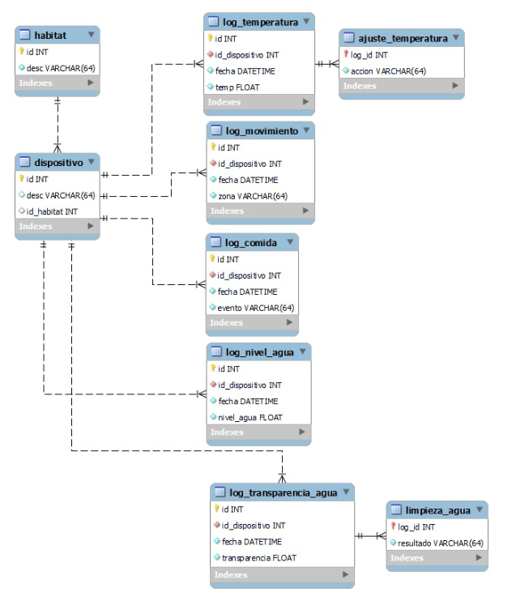

# RogelioRuiz
Portafolio de Evidencias A00835536 

<h1 align="center">Yo soy Rogelio Ruiz</h1>
<h3 align="center">Estudiante de Ingeniería en Robótica y Sistemas Digitales</h3>

- Actualmente aprendo sobre **C++, SQL, Robótica, Desarrollo Web**

- Portafolio: [https://github.com/JRogelioRuiz/RogelioRuiz](https://github.com/JRogelioRuiz/RogelioRuiz)

- Contacto: **A00835536@tec.mx**

- Promedio Acumulado 3er Semestre: **99**
<h3 align="left">Connect with me:</h3>

<h3 align="left">Languages and Tools:</h3>

      

<h3 align="left">Descripción de Evidencias</h3>
  
  <h4 align="left">Electricidad y Magnetismo:</h4>
    

      Programas que modelan el efecto del campo eléctrico y electromagnético en partículas cargadas
    

  <h4 align="left">Estadística:</h4>
    <ul>
      <li>Análisis de Datos en R.</li>
      <li>Análisis de Datos de Experimento de la Botella de Mariotte.</li>
    </ul>

  <h4 align="left">C++:</h4>
    <h5 align="left">Evidencia 1</h5>

      
Fecha: 10/09/2023

       
      
Descripción del Programa:

       
      <ul>
        <li>El programa lee un archivo de datos de errores con sus fechas.</li>
        <li>Regresa otro archivo con los datos ordenados utilizando el algoritmo Quick Sort.</li>
        <li>Pide al usuario un rango de fechas, luego lo despliega en la pantalla y regresa otro archivo con solo esos datos.</li>
      </ul>

    <h5 align="left">Evidencia 2</h5>
      
Fecha: 08/10/2023

       
      
Descripción del Programa:

       
      <ul>
        <li>El programa lee un archivo de datos de errores con sus fechas.</li>
        <li>Da al usuario un menu de opciones donde puede ordenar los datos por fecha, ordenar por IP, encontrar un rango de IPs o desplegar las ips por año y mes.</li>
        <li>Regresa archivos para las operaciones de ordenar datos por fecha, por IP y uno con el rango en orden ascendente y otro con el rango en orden descentente.</li>
      </ul>

    <h5 align="left">Evidencia 3</h5>
      
Fecha: 29/10/2023
 
        
      
 Descripción del Programa: 

       

      <ul> 
        <li>El programa lee un archivo de datos de errores con sus fechas.</li> 
        <li>Da al usuario un menu de opciones donde puede ordenar los datos de mayor a menor (maxHeap) y menor a mayor (minHeap) y regresarlos en un archivo, mostrar las 10 ips que se repiten más veces y encontrar la cantidad de veces que se repite una IP ingresada.</li>
      </ul>

    <h5 align="left">Evidencia 4</h5>
      
Fecha: 01/12/2023
 
        
      
 Descripción del Programa: 

       

      <ul> 
        <li>El programa lee un archivo de datos de ciudades con distancias y tiempos para rutas por carro y por tren hacia otras ciudades.</li> 
        <li>Da al usuario un menu de opciones donde puede ordenar en un archivo las ciudades alfabéticamente, regresar un archivo con la
    lista de adyacencias del grafo de ciudades, recorrer el grafo por DFS y BFS, y regresar la ruta más corta entre dos ciudades con el 
    algoritmo Dijkstra.</li>
      </ul>

  <h4 align="left">IoT:</h4>
    
El propósito del proyecto era facilitar el cuidado de mascotas pequeñas utilizando sensores que permitieran recolectar información sobre el estatus del hábitat y los animales y utilizando actuadores para realizar tareas simples como rellenar la comida y el agua 

     
    
Hábitat de Hamster

      <video width="500px" height="500px" controls="controls">
      <sorce src="https://youtu.be/UayfB8sX1us " type="video/mp4">
      </video>
    
    
Software Utilizados:

     
    <ul>
      <li>ArduinoIDE</li>
      <li>Node.js<li>
      <li>Base de datos en SQL
      
      <li>
    </ul>